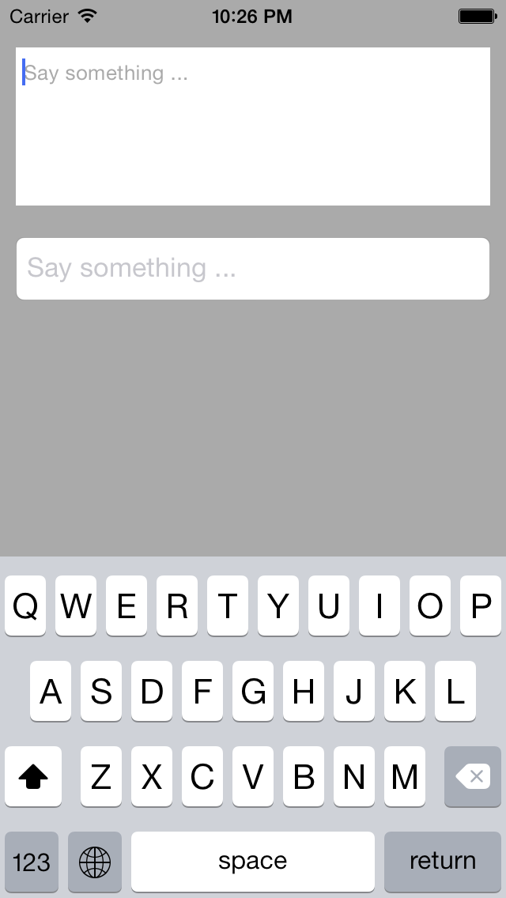
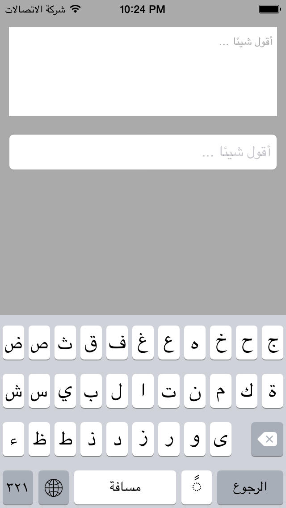

YLTextView
==========

UITextView subclass with placeholder, it supports Arabic language which is Right-To-Left.

###How to use it

Just create the textview and set the placeholder, then add it to a view, done!

    YLTextView* textview = [[YLTextView alloc] initWithFrame:CGRectMake(10, 30, 300, 100)];
    textview.placeholder = NSLocalizedString(@"say_something", nil);
    [self.view addSubview:textview];

### Screen shots

Here are two screen shots for English and Arabic, it shows two kinds of text including LTR and RTL:

